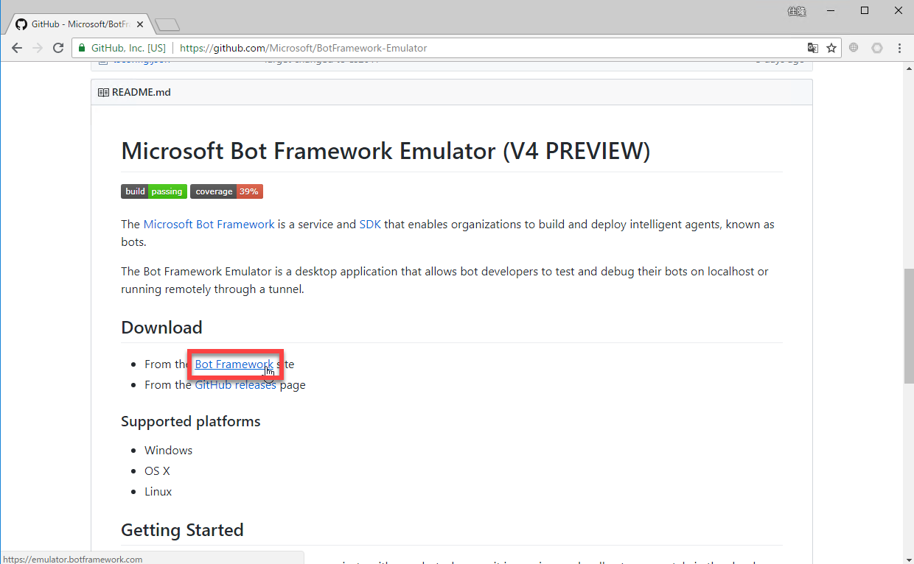
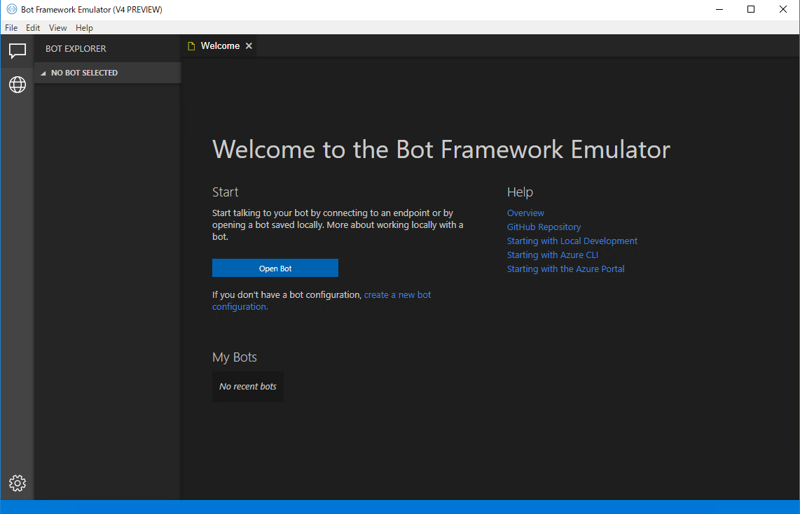
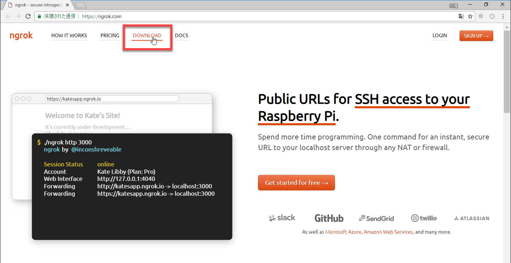
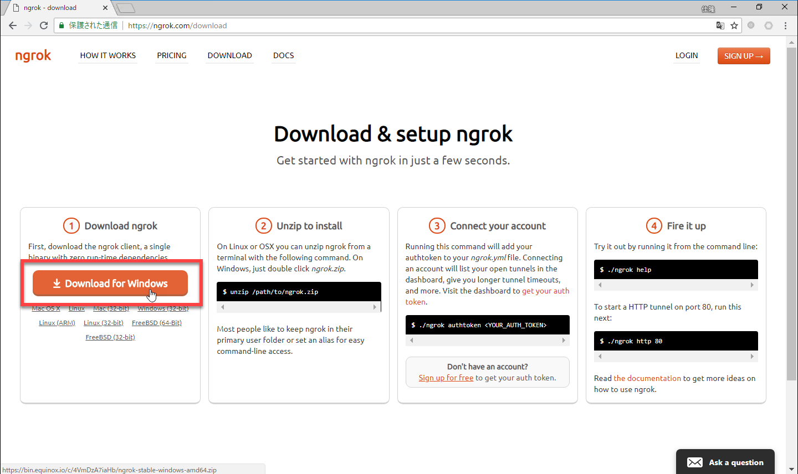
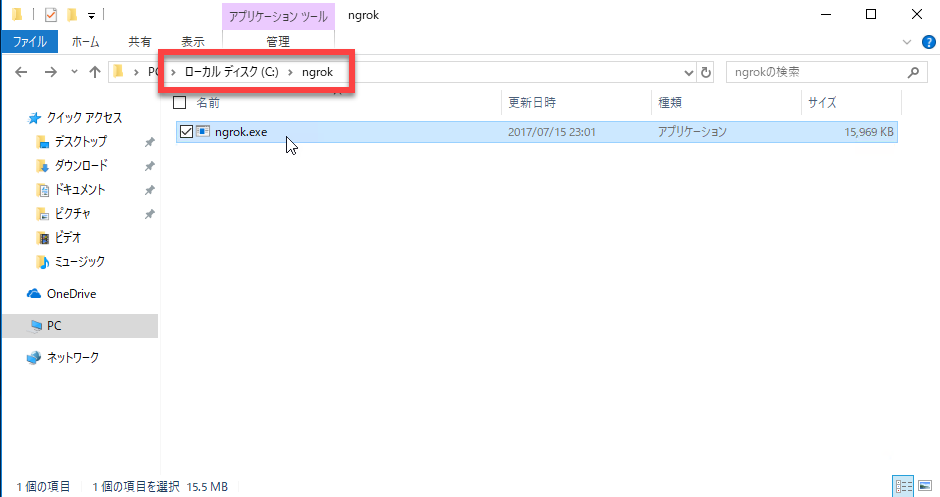
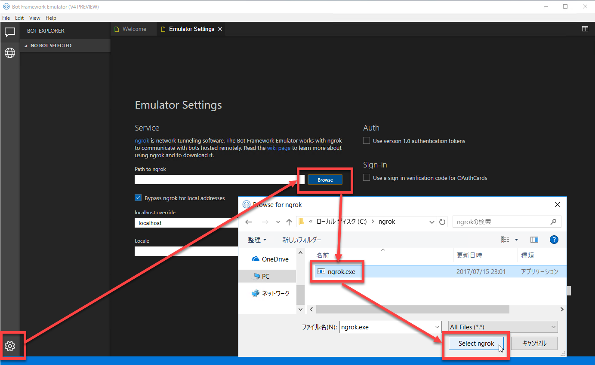
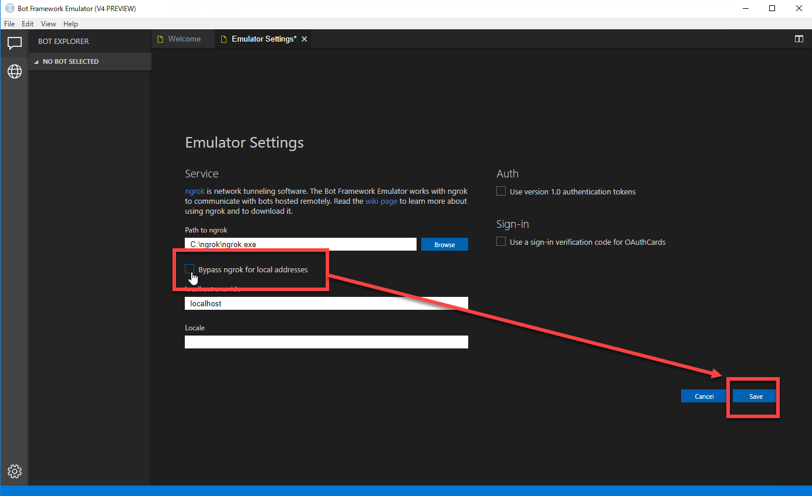

# 開発環境を準備する

このハンズオンでは Bot アプリケーションを **Visual Studio 2017** および **Bot Builder V4 SDK** を使用します。  
また QnA Maker の Web サービスに接続するために、[**ngrok**](https://ngrok.com/) が必要です。

以下ではこれらをインストールして、開発環境を準備します。

---

## Visual Studio 2017 のインストール

1. [**Visual Studio**](https://visualstudio.microsoft.com/ja/vs/) で、インストーラーをダウンロードします。  
有償のライセンスをお持ちの場合は、該当するエディションのインストーラーをダウンロードします。  
個人利用の PC の場合は、Community Edition のインストーラーをダウンロードします。

    

2. Visual Studio 2017 をインストールします。  
ワークロードは以下を選択します。（それ以外を追加で選択してもかまいません）  

    - ASP .NET と Web 開発

     
    

3. Bot Builder V4 SDK をインストールします。  
Visual Studio を起動して、**ツール** - **拡張機能と更新プログラム** を選択します。  
**オンライン** を選択してから、検索ボックスに **"bot builder v4"** と入力して、**Bot Builder V4 SDK Template** をダウンロードします。  
ダウンロードが完了したら、Visual Studio をいったん終了して、再起動します。

    

4. Bot Builder V4 SDK のインストールを確認します。  
**ファイル** - **新規作成** - **プロジェクト** で新しいプロジェクトを開きます。  
**Visual C#** を選択して、検索ボックスに **"bot"** と入力します。**Bot Builder Echo Bot V4** が表示されれば、SDK のインストールに成功しています。

---

## Bot Framework Emulator (V4 Preview) のインストール

Bot アプリケーションのデバッグのためには **Bot Framework Emulator** が便利です。

1. Bot Framework Emulator をダウンロードします。  
[Bot Framework Emulator](https://github.com/Microsoft/BotFramework-Emulator) から [**ダウンロード**](https://github.com/Microsoft/BotFramework-Emulator/releases) ページを開きます。  
最新のインストーラーをダウンロードします。拡張子 exe のものが Windows 用のインストーラーです。

    
    

2. Bot Framework Emulator のインストーラーを実行します。
3. Bot Framework Emulator の実行を確認します。  
インストールに成功すると自動的に Emulator が起動します。

    

---

## ngrok のインストール

Bot Framework Emulator を使用して Bot アプリケーションの動作確認をする場合、外部の Web サービス (今回は QnA Maker のナレッジベースの Web サービス) を呼び出す際に、ngrok が必要です。

1. [**ngrok**](https://ngrok.com/) のサイトに接続します。  
接続したら、**Download** をクリックします。

    

2. **Download for Windows** をクリックして、ngrok をダウンロードします。

    

3. zip ファイル内に **ngrok.exe** があるので、ローカルの任意のフォルダーに展開します。  
インストーラーなどはないので、exe ファイルを直接コピーするだけです。

    

4. Bot Framework Emulator を起動して **Emulator Settings** を開きます。  
**Path to ngrok** の **Browse** ボタンをクリックして、ローカルにコピーした **ngrok.exe** を選択します。

    

5. **Bypass ngrok for local addresses** のチェックをオフにします。  
最後に **Save** をクリックして、設定を保存します。

    

---

以上で、開発環境が整いました。  

次のステップでは QnA Maker で [**ナレッジベースを作成**](03_QnaMaker.md) します。