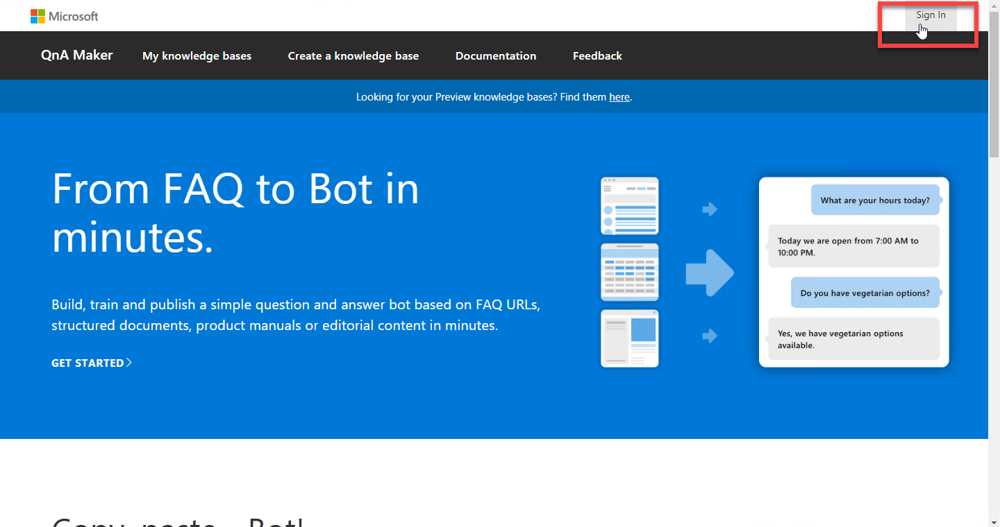
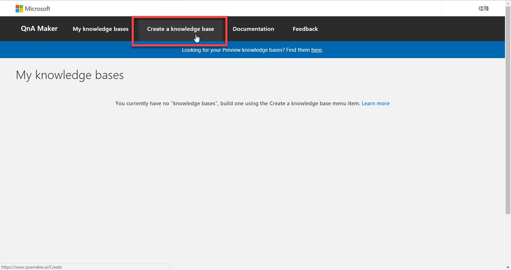
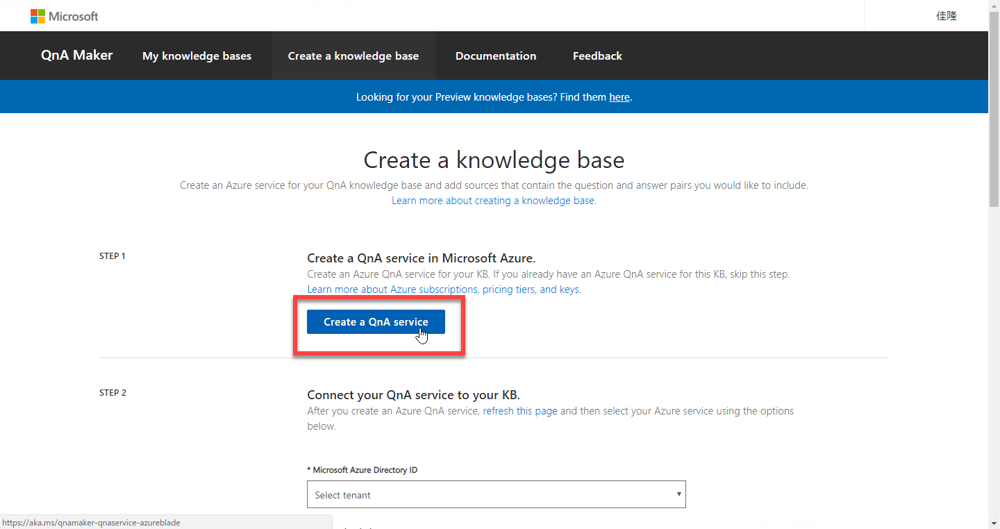
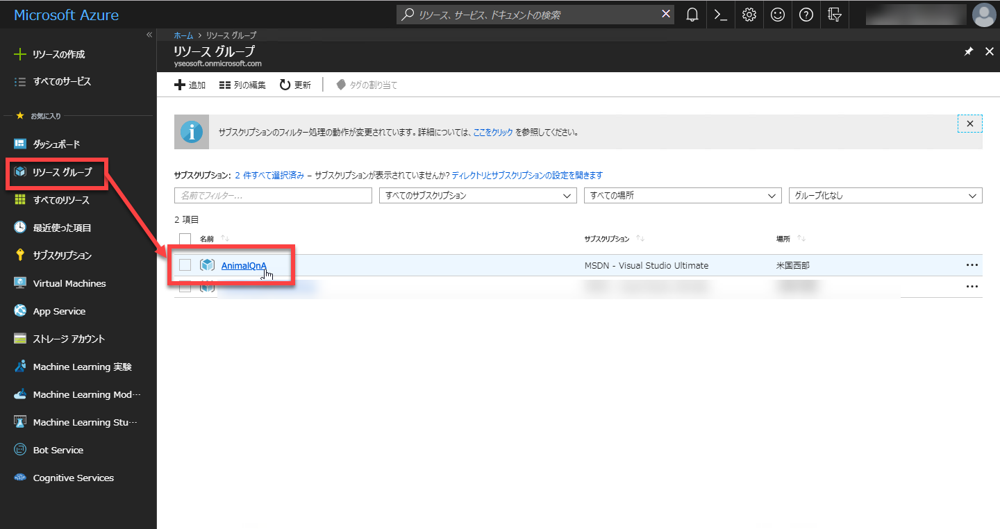
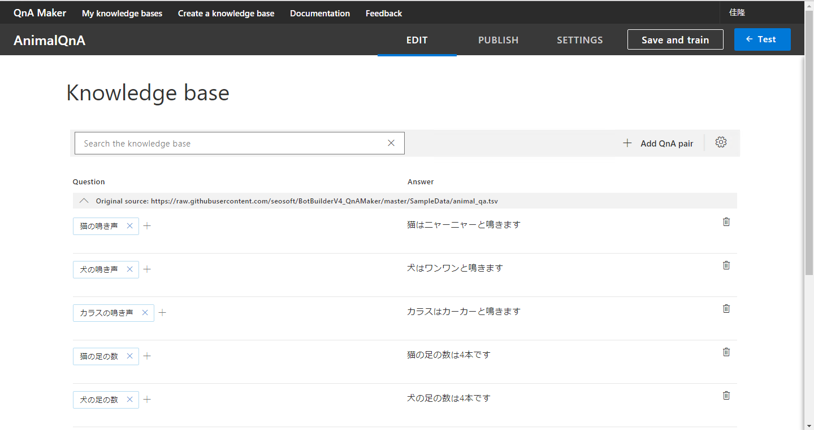

# QnA Maker でナレッジベースを作成する

このステップでは [**QnA Maker**](https://www.qnamaker.ai/) でナレッジベースを作成します。

ナレッジベースを Web サービスとしてデプロイすることで、ChatBot などのアプリケーションから Q&A を利用できるようになります。

---

## QnA Maker

[QnA Maker](https://www.qnamaker.ai/) は Q&A 用のナレッジベースを作成するためのサービスです。

既存の **FAQ ページ** や **Excel などで管理している FAQ データ** をインポートすることで、簡単にナレッジベースを作成できます。  
インポート後のナレッジベースに対して、QnA Maker のサイトで追加の学習を行うこともできます。  
この際の操作は非常に簡単なので、深層学習などの知識は不要です。例えば、ナレッジベースの内容を管理する部門の社員が継続的な保守を行うことができるため、開発者やインフラ担当者に負担をかけることなく、継続的な運用が可能です。

学習済みのナレッジベースは **簡単にクラウドに発行** して Web サービス化することができます。  
Web サービスを利用するには Endpoint Key が必要になるため、安全に利用できます。

以下では、実際に QnA Maker でナレッジベースを作成して、Web サービスとして発行してみます。

---

## ナレッジベースの作成開始

1. [**QnA Maker**](https://www.qnamaker.ai/) に接続します。  
サインインが必要な場合は、Microsoft Azure のアカウントを使用します。

    

2. メインページで **Create a knowledge base** を選択します。

    

3. STEP 1 の **Create a QnA Service** をクリックします。  
自動的に新しいタブが開き、**Azure ポータル** の QnA Maker 作成画面が表示されます。

    

---

## QnA Service の新規作成

1. Azure で QnA Service を新規作成します。  
各項目は以下のように入力します。  
入力できたら **作成** をクリックします。  

    |項目名|設定値|備考|
    |---|---|---|
    |Name|(任意の名前)|このハンズオンの以下の説明では **AnimalQnA** とします|
    |サブスクリプション|(お持ちのサブスクリプション)| |
    |Management pricing tier|F0|サブスクリプションの利用状況によっては **S0** を選択|
    |Resource Group|(任意)| |
    |Search pricing tier|F|サブスクリプションの利用状況によっては **B** 以上のできるだけ小さいものを選択|
    |Search location|米国西部|実際にはそれ以外を選択しても問題ありません|
    |App name|(任意の名前)|Name で決定するもので問題ありません|
    |Website location|米国西部|他を選択してもよいが、Search locationと同じにすることをお勧めします|
    |App insights|Disable|Enableでもよいが、今回は不要|

     
    

2. (必須の手順ではありませんが) App Service プランを **無償のものに変更** します。  
上記の手順で作成した QnA Service は発行される App Service プランが **有償** のものになっています。  
ハンズオンの範囲では無償の App Service プランで問題ないので、このプランを変更します。  
Azure ポータルで **リソースグループ** - **AnimalQnA** (今回作成した QnA Service 名) を選択します。  

    

    AnimalQnA の **App Service プラン** をクリックします。（AnimalQnA は全部で 3個あるので、App Service プランの行を選択するように注意）

    

3. **スケールアップ** を選択します。
    
    

4. **開発/テスト** - **F1** を選択して、無償のプランに変更します。最後に **適用** をクリックして、変更を確定します。

    

以上で、QnA Serviceが作成されました。  
なお実運用する QnA Service の場合などは、App Service のプランは F1 にせずに適切なサイズを選択するようにしてください。

---

## ナレッジベースの作成

1. QnA Maker のナレッジベース作成画面に戻り、STEP 2 の **Connect your QnA service to your KB** で適切なものを選択します。  
なお QnA Service 作成直後は、QnA Maker に QnA Service の内容が反映されていないはずです。QnA Maker の画面を再読み込みして、Azure ポータルの操作を反映させてください。

    

2. STEP 3 の **Name your KB** でナレッジベースの名前を入力します。  
ここでの説明では **AnimalQnA** とします。  

    

3. STEP 4 の **Populate your KB** で、Q&A データを指定します。  
**Add URL** で **https://raw.githubusercontent.com/seosoft/BotBuilderV4_QnAMaker/master/SampleData/animal_qa.tsv** と入力します。

    

    animal_qa.tsv はあらかじめ用意した Q&A ファイルです。
    UTF-8 の TSV ファイルです。ファイルの内容を確認したい場合は、ブラウザーで新しいタブを開き、[https://raw.githubusercontent.com/seosoft/BotBuilderV4_QnAMaker/master/SampleData/animal_qa.tsv](https://raw.githubusercontent.com/seosoft/BotBuilderV4_QnAMaker/master/SampleData/animal_qa.tsv) に接続してみてください。

5. 最後に **Create your KB** ボタンをクリックします。  
少し待つと、AnimalQnA ナレッジベースが完成します。

    
    

---

## aaa

aaa