# QnA Maker でナレッジベースのテストとクラウドへの発行を行う

[**前のステップ**](03_QnaMaker.md) でナレッジベースが作成できました。

一般に、ナレッジベースを作成しただけでは回答の正確性は十分ではありません。  
テスト行って、質問および回答の追加・修正・削除を行ったり、適切ではない質問と回答との関連付けを変更したりします。

QnA Maker では、正確性を向上させるためには深層学習の知識は不要です。  
チャットボット形式のテストパネルを使って、簡単に実施できます。  
テストは一度で完了しなくてもよく、必要に応じて何度でも実施できます。  

テストしたナレッジベースは、QnA Maker のページからクラウドに発行できます。開発者や情報システム部門などに作業を依頼することなく、運用しながらいつでも、必要なタイミングでナレッジベースを更新することができます。

以下では、実際にテストと発行の操作を体験してみます。

もし、まだナレッジベースを作成していなければ、[**前のステップ**](03_QnaMaker.md) でナレッジベースを作成してください。

---

## 作成したナレッジベースをテスト

1. [**QnA Maker**](https://qnamaker.ai/) で対象のナレッジベースを開き、**Test** をクリックします。

    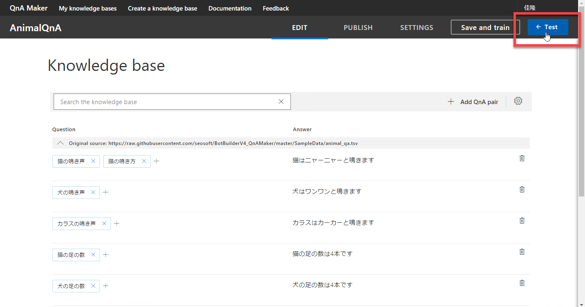

2. チャットボット形式のテストパネルが開きます。  
ここで何か質問を入力します。  
例えば「猫の足の数は」と入力してみます。

    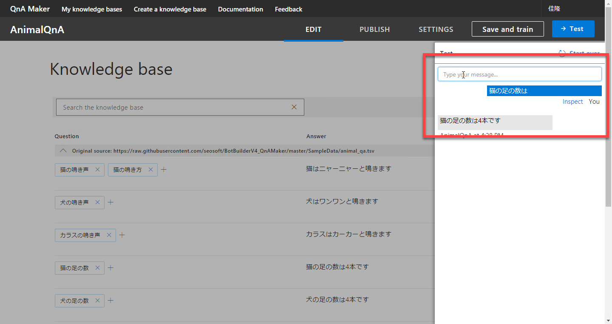

    「猫の足の数は4本です」と期待通りの回答が返ってきます。

3. 別の質問をしてみます。  
例えば「猫って何本足があるの」と入力してみます。

    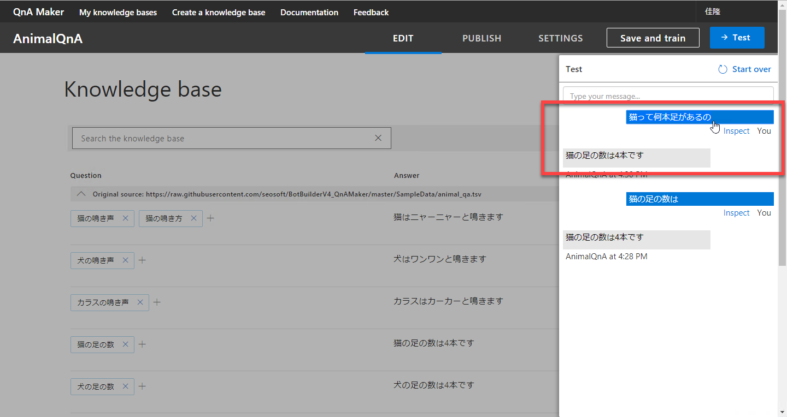

    ここでも「猫の足の数は4本です」と期待通りの回答が返ってきます。この程度の日本語の揺らぎは、うまく吸収してくれます。  
    （異なる回答をしてくるかもしれません）

4. 少し意地悪な質問をしてみます。  
「猫ってなんて鳴くんだっけ」と質問してみます。

    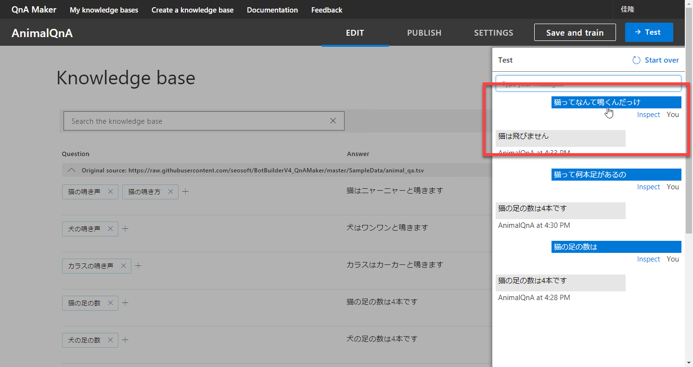

    今回は「猫は飛びません」と答えてきました。正しい答えではありません。  
    （適切な回答をしてくるかもしれません）

回答の正確性を上げるために、このあとでナレッジベースを修正（＝再学習）してみます。

最後に間違った答えを返してきましたが、QnA Maker ではこのような流れでナレッジベースのテストを行います。

---

## テストパネルでナレッジベースの修正

間違った回答を返してきた場合は、テストパネルで簡単に修正することができます。  
直前の操作で、「猫ってなんて鳴くんだっけ」に対して間違った回答をしてきた場合を例に修正方法を見ていきます。

1. 「猫ってなんて鳴くんだっけ」（間違った回答のもとになった質問）のすぐ下にある **Inspect** をクリックします。

    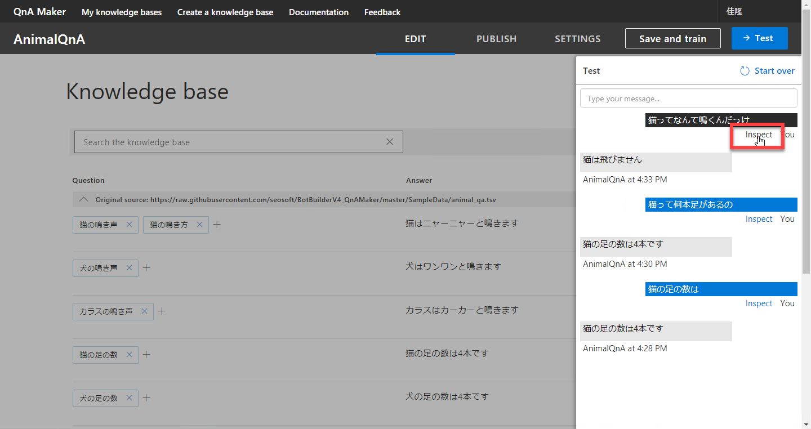

2. **Inspect** パネルが開くので、適切な回答を選択するか、**Enter a new answer here** の部分に新規に回答を入力します。  
今回は「猫はニャーニャーと鳴きます」が適切な回答なので、それをクリックします。

    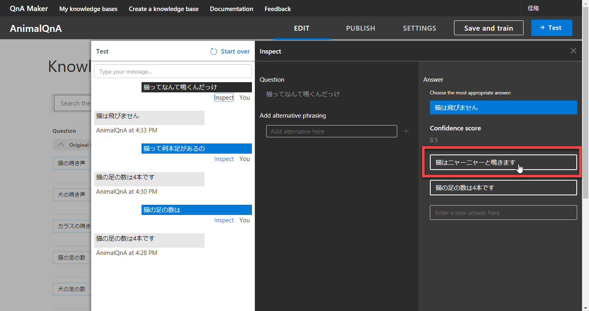

3. 同じ回答を返したい別の質問文がある場合には、**Add alternative here** に入力します。

以上の手順で、ナレッジベースの修正ができます。  
数個のテスト、修正をするだけで、正確性が上がってくるのが分かると思います。

なお成否にかかわらず、Inspect パネルには **Confidence score** が表示されます。  
どの程度自信をもって回答したかの数値（0～100）です。  
適切な回答を返してきた場合でも、この数値が低い時には、ちょっとした表現の違いで異なる回答をする可能性が高くなります。

テストや修正の際は、Confidence score の値も気にしながら作業を進めるといいでしょう。

---

## 編集画面で直接ナレッジベースを編集

テストしながら Inspect パネルでナレッジベースを編集する他に、QnA Maker の **EDIT** 画面（編集画面）で直接ナレッジベースを編集することもできます。  
編集画面での操作は、以下のような場合に便利です。

- 質問または回答に誤字脱字などが見つかった、または文言を簡単に修正してしまいたい
- 質問または回答の内容が古い情報になり（例えば製品情報や社内の手続きに関する Q&A など）削除したい
- ある回答に対する質問を、簡単に追加してしまいたい

編集する個数が多い場合は、編集画面で操作するよりは Excel などで編集して QnA Maker にインポートするほうが楽なこともあります。

### 編集画面で新しい Q&A を登録

既存の Q&A 以外の新しい質問 - 回答の組を新規に登録する場合は、

1. ナレッジベース全体の右上にある **Add Q&A pair** をクリックします。
2. 質問、回答を入力します。それぞれを確定するには TAB キーを押してフォーカスを移動します。（またはマウスで他の箇所をクリックします）

    

### 編集画面で質問または回答の文言変更

誤字脱字の場合を含めて、質問・回答の文言を修正したい場合は

1. 編集画面で該当する項目をクリックします。
2. 文言を修正してから、TAB キーを押します。

の手順で操作します。

### 編集画面で一つの回答に対する質問を追加

前のステップで作成したナレッジベースでは、「猫の鳴き声」という質問に対して「猫はニャーニャーと鳴きます」と回答するようにしています。  
同じ回答を得るために「猫の鳴き方」という質問を追加したい場合は、

1. 既存の質問の隣にある **+** をクリックします。
2. テキストボックスが表示されるので、新しい質問を入力して TAB キーを押します。

    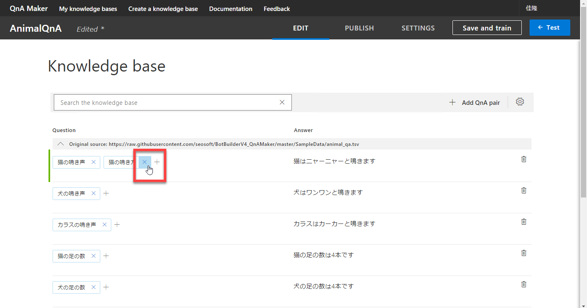

### 編集画面で一つの回答に対する複数の質問のうちの一つを削除

一つの回答に対する複数の質問のうちの一つを削除したい場合は、

1. 削除対象の質問の隣にある **x** をクリックします。

    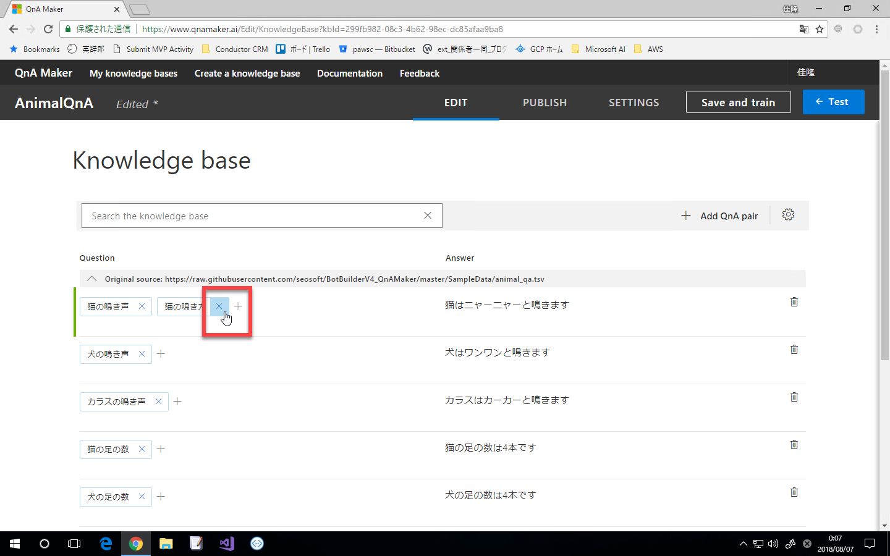

### Q&A を削除

内容が古くなったなどの理由で、Q&A を削除したい場合は、

1. 該当する Q&A の行の右端にある **ごみ箱** をクリックします。

    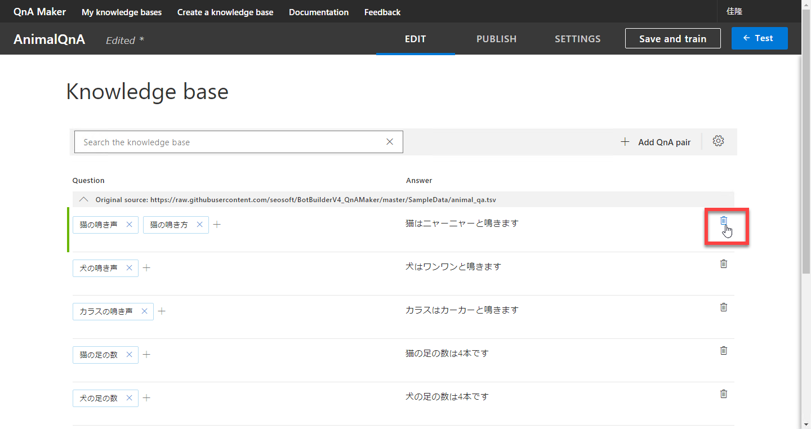

---

## ナレッジベースの保存と再学習

テストパネル、編集画面で編集した内容は、保存および再学習することで、実際にナレッジベースに取り込まれます。  
クラウドに発行して運用環境に反映させるためには、必ず再学習が必要です。

1. **Save and train** をクリックします。少し待つと、再学習が完了します。

    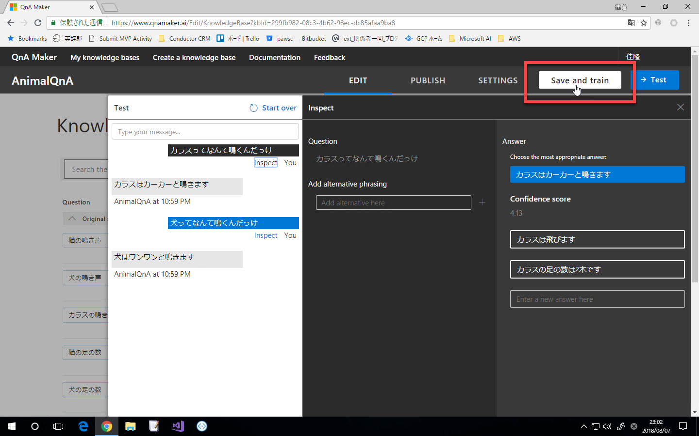

2. 念のために改めて数件のテストを行って、再学習の結果を確認します。

---

## ナレッジベースのエクスポートおよびインポート

QnA Maker で直接ナレッジベースを編集すると、Excel などで管理している台帳と不整合が発生します。

QnA Maker にはナレッジベースの **エクスポート機能** があります。編集画面やテストパネルで編集した内容を含んだ細心のナレッジベースをエクスポートできます。運用時には、定期的にエクスポートを実施するとよいでしょう。

また、Excel などを使ってナレッジベースをメンテナンスするほうが操作として楽なことがあります。  
この場合は、外部のファイルを QnA Maker に **インポート** します。  

1. ナレッジベースをエクスポートするには、**SETTINGS** をクリックして設定画面を開いて、 **Export knowledge base** をクリックします。

    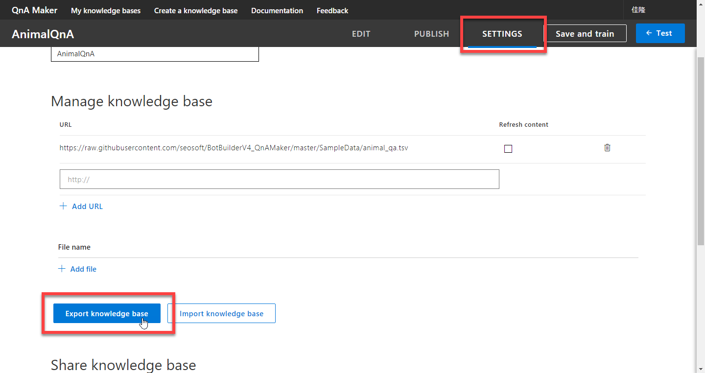

2. ナレッジベースをインポートするには、**SETTINGS** をクリックして設定画面を開いて、 **Import knowledge base** をクリックします。

---

## ナレッジベースをクラウドに発行

学習（再学習）したナレッジベースは、クラウドに発行することでアプリケーションから呼び出して利用できるようになります。

1. **PUBLISH** をクリックします。

    

2. 発行の確認画面が表示されるので、**Publish** をクリックします。

    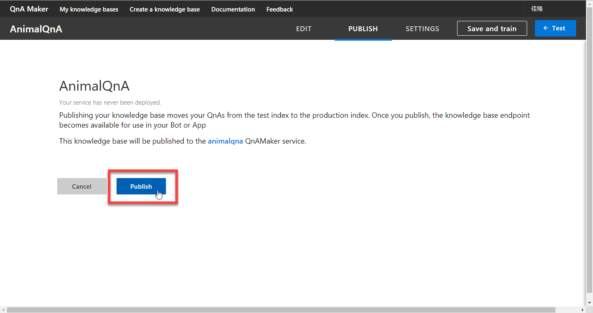

3. 少し待つと、成功画面が表示されます。  
アプリケーションからの呼び出しに必要な、URL や Endpoint Key が表示されていますが、これらの値は別の画面（**SETTINGS 画面**）でも確認できるので、必ずしもここでメモする必要はありません。

    

以上で、ナレッジベースをクラウドに発行できました。  
アプリケーションからナレッジベースを利用する方法は、[**次のステップ**](05_BuildBotApp.md) 以降で紹介します。