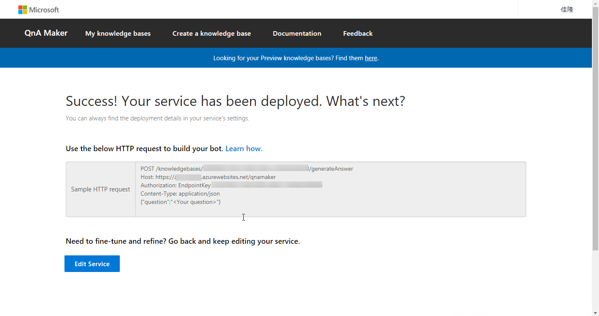
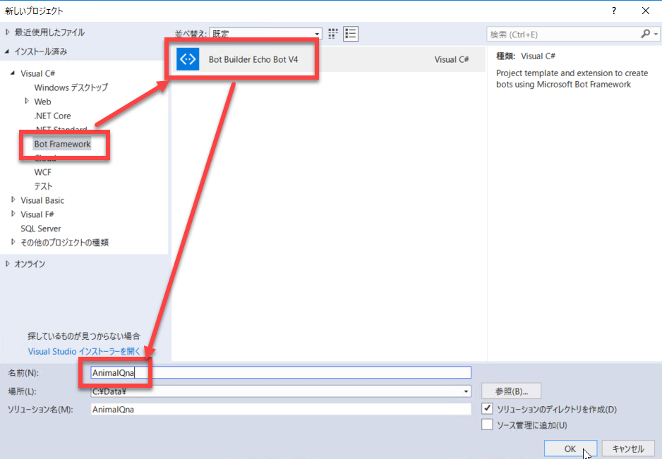
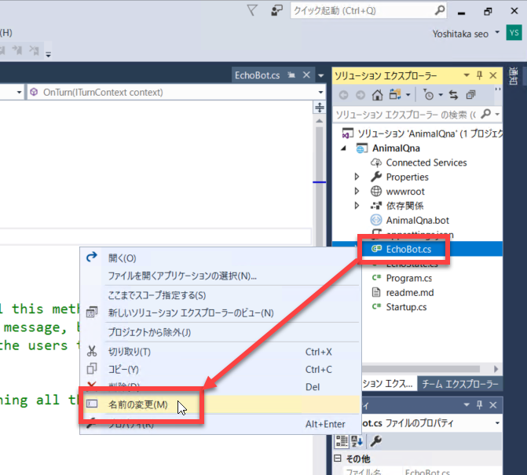
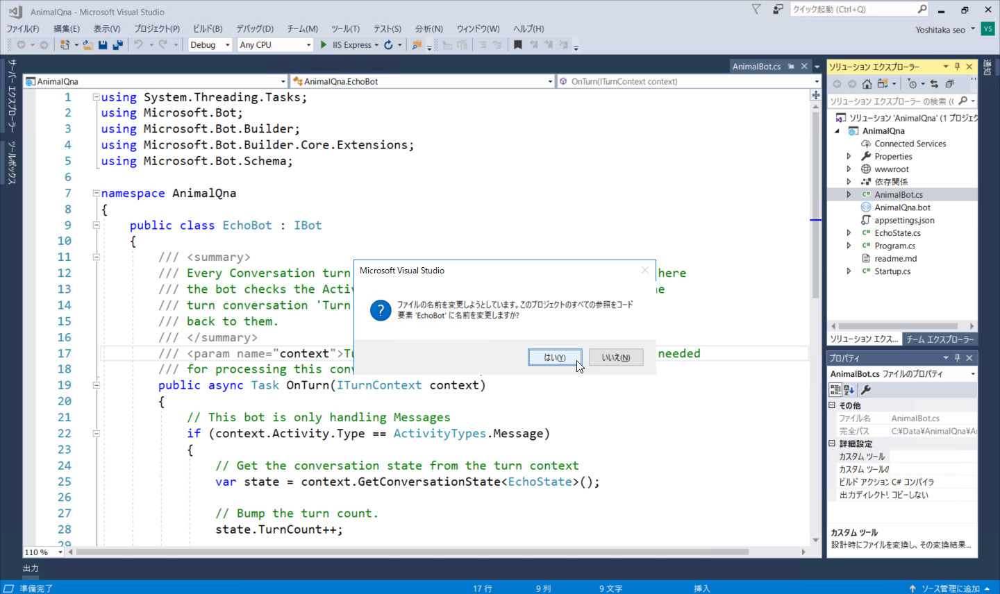
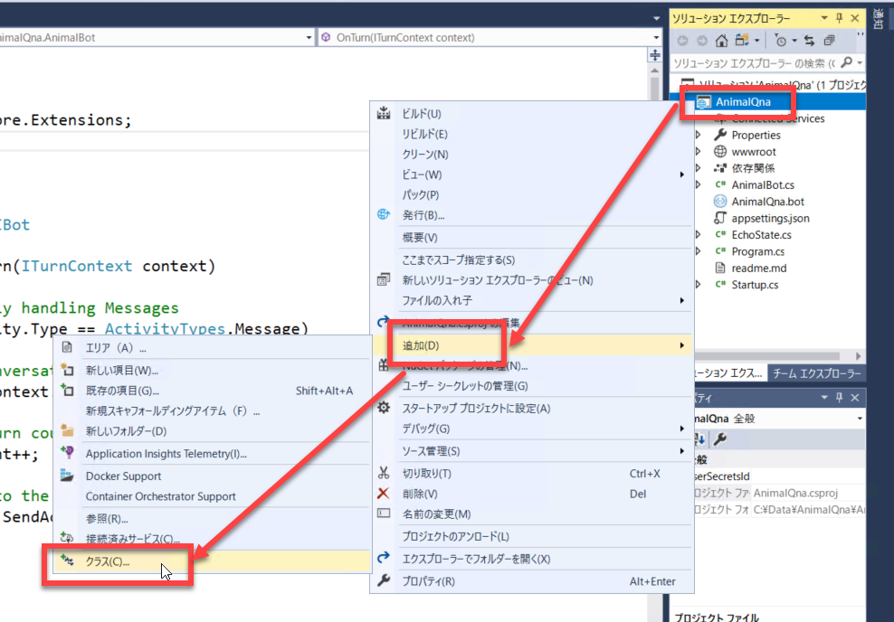
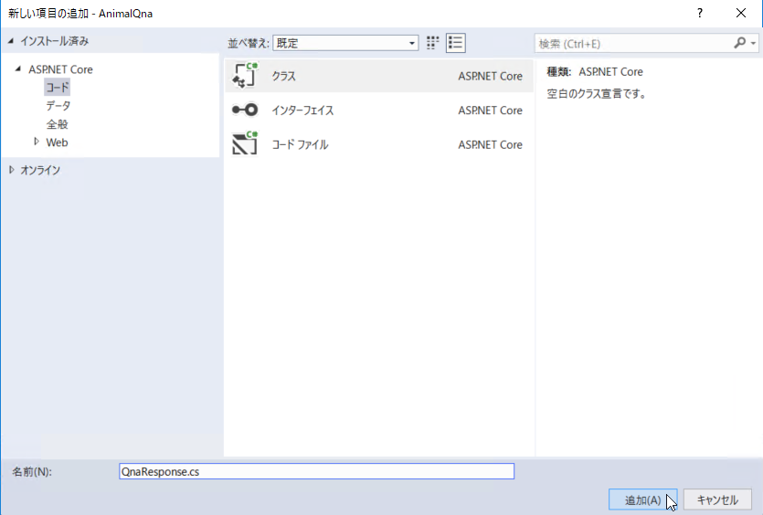
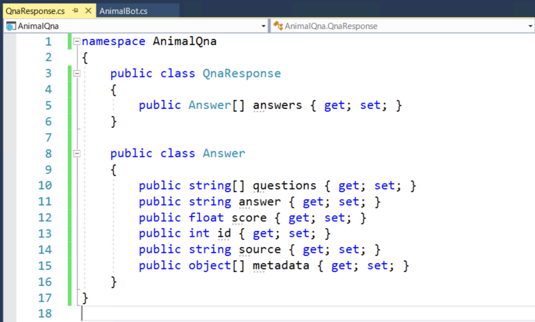
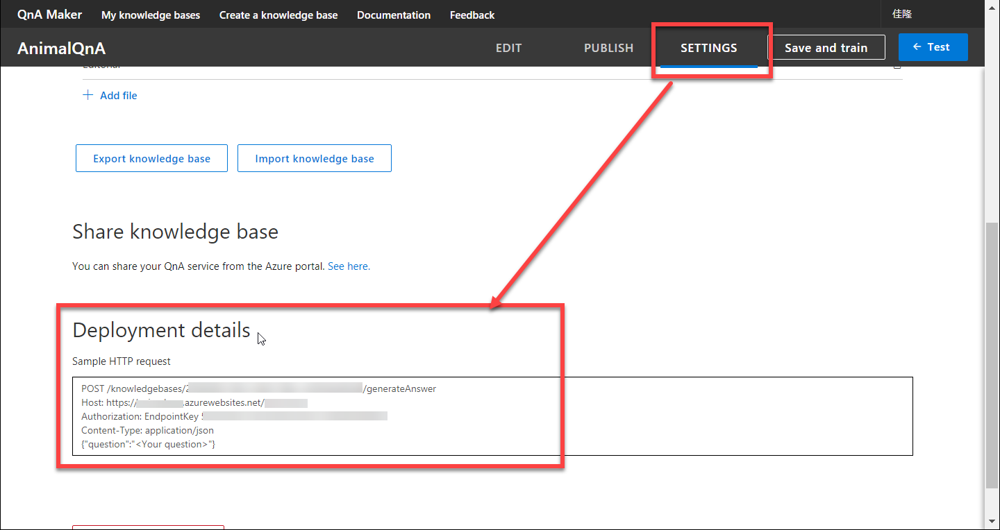

# Bot アプリケーションを作成する (REST API 呼び出し版)

[**前のステップ**](04_TestQnaMaker.md) でナレッジベースをクラウドに発行しました。




続いて、発行したナレッジベースを利用するアプリケーションを作成します。

ここで作成するのは Q&A の定番でもある **Bot アプリケーション** です。  
Bot Builder SDK V4 を使うと、簡単に Bot アプリケーションが作れます。

クラウドに発行した QnA Maker のナレッジベースは RESTful な Web サービスです。
以下では、一般的な Web の知識だけで Bot アプリケーションを作ってみます。

---

## Visual Studio で新しいプロジェクトを作成

以下の手順を実行するには、[**開発環境を準備する**](02_DevelopEnv.md) で Visual Studion 2017 と Bot Builder V4 SDK をインストールしておく必要があります。

1. Visual Studio 2017 を起動します。  
Visual Studion 2017 を起動して、**ファイル** - **新規作成** - **プロジェクト** を選択します。
2. Bot Builder のプロジェクトテンプレートを選択します。  
**Visual C#** - **Bot Builder Echo Bot V4** を選択して、プロジェクト名を入力します。  
プロジェクト名は任意ですが、以下では "AnimalQna" として進めます。

    

3. (必須の手順ではありませんが) プロジェクトができたら、**"EchoBot.cs"** のファイル名を変更します。  
ソリューションエクスプローラーで **EchoBot.cs** で右クリックして、**名前の変更** を選択します。新しいファイル名として、ここでは **AnimalBot.cs** とします。  
プロジェクト全体で、参照しているクラス名変更の確認が表示されます。"はい" を選択して、クラス名を変更します。

    
    

    プロジェクトテンプレートで作成されるのは、EchoBot (オウム返しする Bot) なので、今回作成する Bot アプリケーションに合わせて名前を変更します。  
    なお Bot クラスの他に **State** クラス (会話の履歴やユーザーの情報などを保持しておくためのクラス) のファイル名も変更するべきですが、今回はステートは使用しないのでファイル名変更を省略します。

---

## Web サービスのレスポンスクラスを追加

QnA Maker のナレッジベースを発行すると、JSON フォーマットで応答する Web サービスになります。  
そこでレスポンスをデシリアライズして利用しやすくするためのクラスを作成します。

1. **ソリューションエクスプローラー** の **プロジェクト名** (今回は AnimalQna) で右クリックして、**追加** - **クラス** を選択します。  
ファイル名は任意ですが、ここでは "QnaResponse.cs" とします。

    
    

2. QnaResponse.cs 全体を以下の内容で置換します。  

    - using 句はすべて削除してかまいません
    - namaspace はそのまま残しておきます
    - 生成された QnaResponse クラスの定義（中身は空）を削除して、以下のコードを貼り付けます

    ```
    namespace AnimalQna
    {
        public class QnaResponse
        {
            public Answer[] answers { get; set; }
        }
        
        public class Answer
        {
            public string[] questions { get; set; }
            public string answer { get; set; }
            public float score { get; set; }
            public int id { get; set; }
            public string source { get; set; }
            public object[] metadata { get; set; }
        }
    }
    ```

    

---

## Bot クラスの定義

❞AnimalBot" の **OnTurn** メソッド、および Web サービスから Q&A の回答を取得するメソッド (GetAnswer) を定義します。

1. **AnimalBot.cs** の先頭に **using 句を 4行追加** します。  

    ```
    using System;
    using System.Text;
    using System.Net.Http;
    using Newtonsoft.Json;
    ```

2. **AnimalBot** クラスの中身を以下のコードで置換します。  
先頭に定数の定義が 3個あります。これらはすぐ後の手順で置換します。

    ```
    public class AnimalBot : IBot
    {
        private const string EndpointKey = "ここにEndpointKey";
        private const string Host = "ここにWebサービスのURL";
        private const string KnowledgebaseId = "ここにKnowledgebaseId";

        private const string RequestUri = Host + "/knowledgebases/" + KnowledgebaseId + "/generateAnswer/";

        public async Task OnTurn(ITurnContext context)
        {
            if (context.Activity.Type == ActivityTypes.Message)
            {
                var response = await GetAnswer(context.Activity.Text);
                var qnaResponse = JsonConvert.DeserializeObject<QnaResponse>(response);
                await context.SendActivity($"{qnaResponse.answers[0].answer} ({qnaResponse.answers[0].score})");
            }
        }

        private static async Task<string> GetAnswer(string message)
        {
            var question = $"{{\"question\": \"{message}\"}}";

            using (var client = new HttpClient())
            {
                using (var request = new HttpRequestMessage())
                {
                    request.Method = HttpMethod.Post;
                    request.RequestUri = new Uri(RequestUri);
                    request.Content = new StringContent(question, Encoding.UTF8, "application/json");
                    request.Headers.Add("Authorization", "EndpointKey " + EndpointKey);

                    var response = await client.SendAsync(request);
                    return await response.Content.ReadAsStringAsync();
                }
            }
        }
    }    

    ```

---

## QnA Maker の Web サービスの URL、キーの確認

[**前のステップ**](04_TestQnaMaker.md) でクラウドの発行した際の設定値を確認して、上のコードを置換します。

1. [**QnaMaker のサイト**](https://qnamaker.ai/) を開いてサインインし、前のステップで作成したナレッジベースを開きます。  
続いて、**SETTINGS** をクリックして **Deployment details** の部分から以下の内容をコピーして、**AnimalBob.cs** の対応する箇所に貼り付けます。

    - 1行目 の "/knowledgebases/" と "/generateAnswer" との間の英数字・・・**KnowledgebaseId**
    - 2行目の "https://" 以降 (https:// も含めて) ・・・**WebサービスのURL**
    - 3行目の "EndpointKey" の後の英数字 ・・・**KnowledgeId**

    


---

## ビルド

1. 以上のコードを書いたら保存して、ビルドしてみます。  
エラーがなければ [**次のステップ**](06_BfEmulator.md) に進んで、**Emulator** を使って動作確認します。