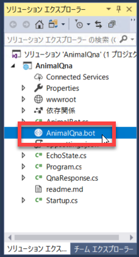
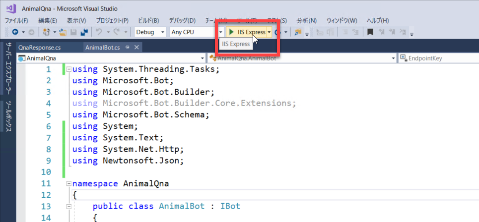
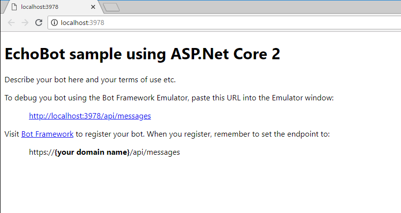
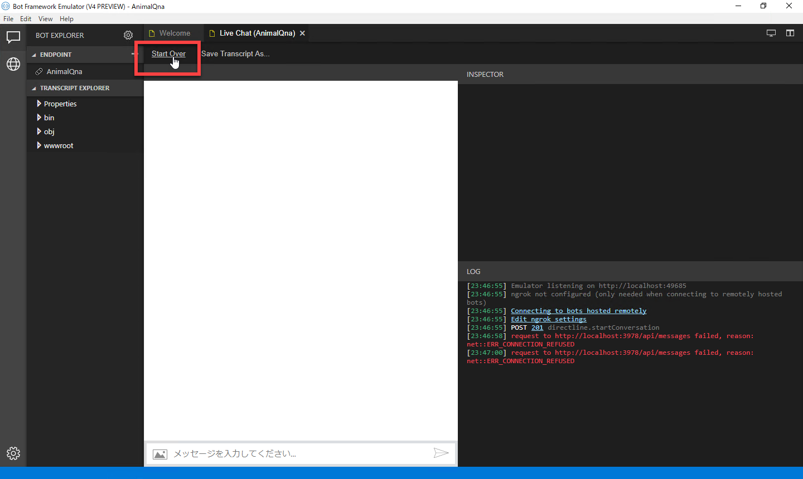
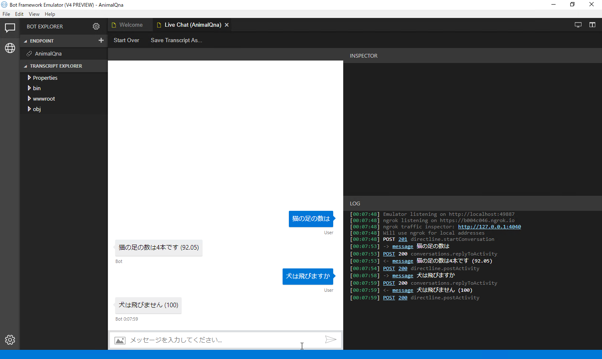

# Emulator で動作を確認する

QnA Maker で [ナレッジベースを作成](04_TestQnaMaker.md) し、Visual Studio 2017 + Bot Builder V4 SDK で [Bot アプリケーション](05_BuildBotApp.md) を作成しました。

以下では、Bot Framework Emulator を使って、実際に Bot アプリケーションの動作を確認してみます。  
Bot Framework Emulatator は ["開発環境を準備する"](02_DevelopEnv.md) のステップでインストールしているはずです。まだインストールしていない場合は、["開発環境を準備する"](02_DevelopEnv.md) に戻ってインストールを完了してください。

---

## Bot Framework Emulator を Visual Studio から起動できるように設定

Bot Framework Emulator をスタートメニューから起動して、拡張子 ".bot" ファイルを開くことで Bot アプリケーションに接続できます。  
ただし ".bot" ファイルは Visual Studio 2017 の　Bot アプリケーションのプロジェクトフォルダー内にあるので、VS の環境内から直接起動するほうがスマートです。

以下の手順は　Visual Studio 2017 をインストールした PC ごとに 1回だけ実行すればいいものです。

1. [こちらのブログページ](https://yseosoft.wordpress.com/2018/06/08/bfv4_emu_runfromvs/) に設定方法を記載しました。  
それを参照して設定を行います。

---

## Bot Framework Emulator で動作確認

1. （上の設定を行っている場合、）Visual Studio 2017 のソリューションエクスプローラーで **AnimalQna.bot** (拡張子 ".bot" ファイル) をダブルクリックします。  
Bot Framework Emulator が起動します。  
この状態で、AnimalQna をローカル実行した場合の IIS に接続する準備ができています。

2. Visual Studio 2017 で **IIS Express** でデバッグ実行を開始します。

    

3. Web ブラウザーが自動的に開きます。  
ローカルの IIS で Bot アプリケーションが動作しているので、Emulator での動作確認が終わるまでブラウザーを開いたままにします。

    

4. Bot Framework Emulator で **Start Over** をクリックします。

    

5. Bot Framework Emulator で質問を入力します。  
Bot アプリケーションが回答を返してきます。

    

---

以上で、Bot アプリケーションの動作を確認できました。

- QnA Maker でナレッジベースを作成、さらにクラウドに発行
- Visual Studio 2017 + Bot Builder V4 SDK で Bot アプリケーションを作成
- Bot Frammework Emulator で動作確認

の手順はすべて完了です。